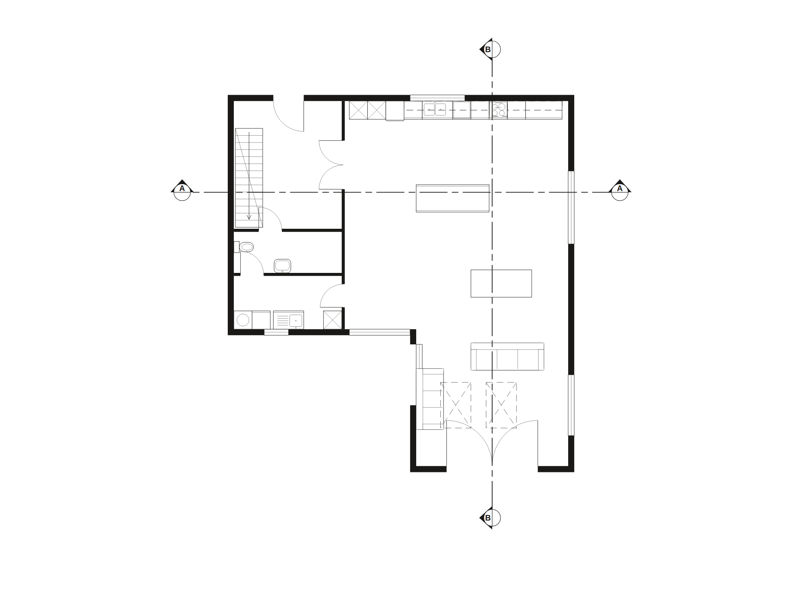
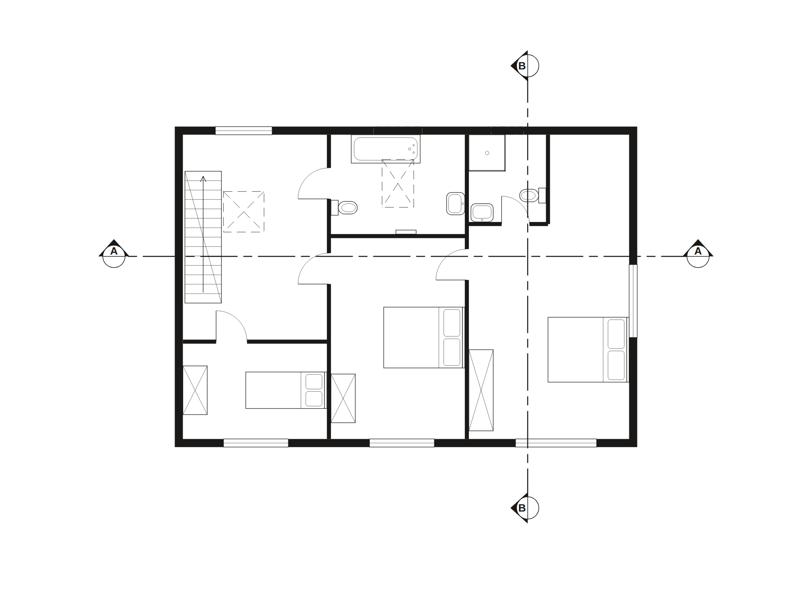

# Skopia

**A 2D spatial layout engine, reachable as an MCP server.** Define a bounded
space in real millimetres, place things in it, validate, render, project
elevations and sections from the plan — one floor or a whole house — and hand
the set on to CAD as a DXF.



*A contemporary house, ground floor: built and furnished through the
operations an agent calls, every fixture from the stock and turned by the wall
it names, both cut lines placed by rule. The engine's own render of the
document, not a drawing of it.*

```
https://skopia.datatreehaus.com/v1
```

[](https://registry.modelcontextprotocol.io/v0/servers?search=skopia)
[](https://cursor.com/en/install-mcp?name=skopia&config=eyJ1cmwiOiJodHRwczovL3Nrb3BpYS5kYXRhdHJlZWhhdXMuY29tL3YxIiwiaGVhZGVycyI6eyJBdXRob3JpemF0aW9uIjoiQmVhcmVyICR7ZW52OlNLT1BJQV9LRVl9In19)
[](https://vscode.dev/redirect/mcp/install?name=skopia&config=%7B%22name%22%3A%22skopia%22%2C%22type%22%3A%22http%22%2C%22url%22%3A%22https%3A%2F%2Fskopia.datatreehaus.com%2Fv1%22%2C%22headers%22%3A%7B%22Authorization%22%3A%22Bearer%20%24%7Binput%3Askopia-key%7D%22%7D%2C%22inputs%22%3A%5B%7B%22id%22%3A%22skopia-key%22%2C%22type%22%3A%22promptString%22%2C%22password%22%3Atrue%2C%22description%22%3A%22Your%20Skopia%20key%20(free%2C%20from%20https%3A%2F%2Fskopia.datatreehaus.com)%22%7D%5D%7D)

Every call needs a key. Getting one is free, instant, and needs no approval.
The one-click installs above carry no key: Cursor reads `SKOPIA_KEY` from
your environment, VS Code asks for it as it installs.

## Quick start

```bash
# 1. get a key
curl -X POST https://skopia.datatreehaus.com/v1/keys \
  -H 'content-type: application/json' \
  -d '{"label":"my agent","email":"you@example.com"}'

# 2. add the server
claude mcp add --transport http skopia \
  https://skopia.datatreehaus.com/v1 \
  --header "Authorization: Bearer YOUR_KEY"
```

Cursor, VS Code, Codex, `.mcp.json` and raw HTTP are covered at
[/setup](https://skopia.datatreehaus.com/setup).

**ChatGPT, Claude Desktop and claude.ai need no key at all.** Their
connector dialogs take an MCP server that speaks OAuth, and this one does:
paste `https://skopia.datatreehaus.com/v1`, and the consent page mints a key
for that connection which you never see. No account is created; the key is
the whole of it, and it is revocable like any other.

**Protocol:** MCP over Streamable HTTP. The server is built on revision
`2026-07-28` (`server/discover`, no `initialize`) and also speaks the
initialize-era revisions — `2025-11-25`, `2025-06-18`, `2025-03-26`,
`2024-11-05` — so an ordinary client just connects: open with `initialize`,
name your revision in `MCP-Protocol-Version`, and none of the newer
revision's mirrored headers or `_meta` fields are asked of you. `initialize`
and `ping` are the only calls that need no key.

## What it does that a model cannot do for itself

A model asked to draw a floor plan will emit SVG, and it will look entirely
fine. The walls will not quite close, the elevation will not agree with the
plan, and the door will swing out of its hinge. Nothing will fail. That is
the problem this exists to remove.

**An agent cannot draw a door wrong here, because it does not draw the
door.** It names one — panelled, part-glazed, three rows — and the same
component answers in the plan, the elevation and the section. The swing is
derived once and reviewed once, and cannot come out of the hinge on a
Tuesday.

- **Elevations cannot disagree with the plan.** Not through care. A
  horizontal position in an elevation is a *reference* to a plan feature
  (`opening:3.jamb.left`), so there is no field anywhere that could hold a
  wrong number.
- **It asks instead of guessing.** Give it a survey and `missing_dimensions`
  tells you which measurements were never actually taken, rather than picking
  a plausible number that closes the ring. From the moment software invents
  that number it is indistinguishable from a measured one.
- **Components are asked for, not drawn.** `{"type": "sash", "panes": [3, 2]}`
  is a six-over-six sash. The same window as SVG path data is around fifty
  times the tokens, and a model can get path data subtly wrong in ways nothing
  checks.
- **Refusals name the problem.** Typed, permanent error codes saying *which*
  object offended, because an agent cannot act on "invalid layout".
- **Advisory reads never decide.** `suggest_joins` reports which tables could
  be pushed together and changes nothing. Adjacency may suggest; a person
  decides.
- **No regulatory figures ship here.** Gangway widths, egress distances and
  wheelchair ratios are yours to supply and yours to stand behind. Wrong
  numbers inside software a fire officer reads are a liability, not a bug.

## We wrote the alternative, and it was wrong three times

The case for this had to be tested rather than asserted, so the competitor is
a real file in our repository: a hand-written script that draws the same
house. It was written with the engine's source open — its palette, its wall
conventions, its house data — and corrected three times against renders with
a person reviewing. It is not a cold run and we will not present it as one.

Which makes the failures sharper rather than softer. Given every one of those
advantages, it was still wrong three times.

1. The door's swing arc sprang from the *hinge* instead of the leaf's tip, so
   it floated into the room ending nowhere near the far jamb.
2. Windows were bare white gaps — no frame, no glass line. A hole in a wall,
   not a window.
3. The internal walls had **no doors in them at all**. Three rooms, no way
   into any of them.

Every version rendered cleanly. Two of the three faults were invisible at the
size the drawing was reviewed at, and the third survived two rounds of review
looking perfectly reasonable. An agent running unattended ships it.

**Tokens are not the argument.** On raw count, a script an agent writes once
still beats calling this — the drawing goes to a file, where a tool result
comes back into the context — and our own benchmark says so plainly rather
than burying it. The argument is that the cheap path's failures are silent,
plausible, and found by a human or not at all.

The cheap version is the wrong one, every time.

We have **not** measured tokens-to-completion for a cold agent. That needs a
real run against a brief, with no sight of this engine's source, recorded to
the point where the drawings are actually right. We have not done it, and
nothing above is quoted as though we had.

## And then we ran it ourselves, and it was wrong too

One agent, one brief, this engine, September 2026. It cost about **269,000
tokens** and the drawings came out wrong: a section facing the wrong way, a
blank section B–B, a two-over-two sash that was not one, 1:50 too small for
the sheet, and eight dimension queries too small to read.

- **Looking is the job.** About 100,000 of those tokens — 37% — were
  rendering a drawing and looking at it, roughly 8,000 a picture. An agent
  writing its own SVG has the identical loop at the identical price, so the
  biggest cost in the job is common to both sides and cancels out of the
  comparison entirely. Our own benchmark never counted it.
- **Reading the engine cost ~65,000 tokens** before any work started. Over
  MCP that is a tool list instead — which is the honest argument for the
  server, and one we had backwards.
- **The refusals did their job.** A spot level the schema could not hold and
  two unused wall thicknesses were reported rather than silently dropped.

So: naming a component removes a *class* of error, not the category. An agent
can still ask for the wrong one, point a section the wrong way, or produce a
drawing that comes out blank. We have done all three.

We have **not** run the other side cold. There is no A/B here and we will not
imply one.

## A house is storeys



*The first floor, a second document against the same datum. The stair arrives
where the ground floor's leaves; a section through both is one drawing, joined
by the engine and checked at the junction.*

A storey is not a new kind of thing. Each floor is an ordinary document with
its own heights against one shared datum, and a section or an elevation is
projected from every floor and **joined** into one drawing: the same wall
stated by two floors is one band from the slab to the eaves, an elevation
face runs through the floor line with no seam, and the junction is drawn as
one outline because every floor's cut is in one region. Alignment comes from
two fixed points you name on every plan (`vertex:0.outer` — the outer corner,
which stays put when a wall thins upstairs), and it is checked, never
fitted: a rotated survey, a floor that stops short of the one above, or a
ceiling that does not meet the floor construction over it is refused with
the millimetres. The basis is reported in numbers and, on request, drawn on
every plan and joined drawing, so nobody has to take the join on trust.
`draw_sheet` takes `storeys` instead of `document` and does all of this on the
way to the paper.

## Furniture that draws itself in section

A bath, a base unit, a WC, a stair: `{ "op": "add_fixture", "type": "bath",
"at": {x, y} }` places one at a typical trade size, by the corner that goes
into the room's corner. The plan shows it as what it is; a section sees it
beyond the plane as the face it is looking at, and cuts it as its own
profile — the tub, the worktop over the carcass, the flight's sawtooth —
with which face and which profile derived from how it is turned. Its extent
on the section is a reference to the plan, so it lands where the plan put it.
Twenty-two types, kitchen, bathroom and bedroom, and none of them carries a
regulation: sizes are trade sizes, and clearances are yours to state.

## A fixture knows which way it goes

Every type in the stock carries its placement rules: whether its back
belongs against a wall, and how much a person needs clear off each edge to
use it. Place one with `against: {wall}` and the engine turns it to face
into the room; validation reads the rules back and names a WC facing its
wall, a basin floating, a sofa with its seat to the wall, and what is in the
way. Findings, not refusals.

## Roof windows

`{ "op": "add_rooflight", "x", "y", "w", "d" }` puts a window in the roof.
Which slope it sits in and how far up it are derived from the roof the plan
already carries: it shows on the elevation that faces that slope, at the
height the pitch gives it, and on no other. Through a flat roof a section
opens the ceiling where the plane crosses it, with the kerb and the glass.

## One style, in the engine

Every drawing comes out the same way: solid black poché for what the plane
cuts, a white ground inside and out, furniture and fittings as fine outline
with no fills, three line weights, one light tone for a roof or a cill seen
against a face, one tint for glass. It is how the leading practices present
plans, and it lives in the drawing functions rather than in anything you
pass — a plan, a section and an elevation of the same house cannot come out
in three styles.

## Section marks, by rule

A cut line wears a head from a small family, the bubble by default: a
filled triangle pointing the way you look, a circle over it, the reference in
the pointed half. Place it as a point and a direction (`add_section` with
`through` and `along`) and the engine runs the line evenly a metre and a half
past the outer face of the building at both ends. A line given as two points
is measured against that rule, and one that stops short or runs long at one
end is reported with both distances rather than left to be noticed on paper.

## On to CAD

`export_dxf` takes what `draw_sheet` takes and answers with one DXF: model
space, millimetres, y up, the plan at the document's own coordinates so a
wall measured in AutoCAD is the wall the document stores. Walls are their two
faces and the jambs at every opening, doors have their swings, fixtures and
components are the same primitives the sheet draws, and what a section cuts
is one outlined region with a solid hatch. Layers are named by role — `WALL`,
`DOOR-SWING`, `CUT-POCHE`, `EVIDENCE` — and carry the engine's three line
weights, so a plot from CAD matches the sheet. The sheet, the title block and
the scale bar stay on the sheet: a DXF is model space.

## When not to use it

If you want one sketch, once, and nobody is going to build from it, emit the
SVG yourself. It is free, it needs no key, and it will be fine.

Reach for this when the drawings have to agree with each other, when somebody
is going to measure one, or when nobody is going to be looking over the
agent's shoulder.

## Tools

| | |
|---|---|
| `edit_layout` | Build or change a layout by applying operations |
| `list_operations` | The fifty-seven-operation vocabulary |
| `validate_layout` | Typed errors naming which object offended |
| `render_layout` | Deterministic SVG |
| `draw_sheet` | A plan and its sections on one sheet, true to scale |
| `export_dxf` | The same drawings as one DXF for CAD, at 1:1, layered by role |
| `project_elevation` | An elevation projected from the plan |
| `project_section` | A section cut through the plan, internal walls and all |
| `suggest_sections` | Where a section could go, and what each place would show |
| `join_drawings` | One section or elevation across several storeys, junction checked and drawn clean |
| `list_components` | The window and door stock |
| `list_fixtures` | The kitchen, bathroom and furniture stock, drawn on plan and through a section |
| `suggest_joins` | Which objects could be pushed together |
| `suggest_rotation` | Which way an object should face |
| `check_rules` | Check against rules *you* supply |
| `overhead_report` | What a section will have to reckon with |
| `roof_report` | Which roof readings are still missing, as questions |
| `missing_dimensions` | Which measurements the survey never took |

Eighteen tools is standing context on every turn, so narrower surfaces exist:
`/v1/core`, `/v1/elevation`, `/v1/advisory`, and they compose
(`/v1/core+elevation`). A key can carry a profile instead.

Every tool is a pure function and says so over the wire (`readOnlyHint`,
`idempotentHint`): nothing is stored, so a client that auto-approves
read-only tools can approve all of these.

## Prompts

Four workflows, served as MCP prompts, so a client that lists them shows the
order to do things in rather than a vocabulary. In Claude Code they arrive as
slash commands.

| | |
|---|---|
| `build_a_room` | A description of a room to a validated, rendered plan |
| `survey_to_drawings` | A measured survey to plan, sections and elevations, asking for what was never measured |
| `check_a_layout` | Validate, then check against a spacing rule *you* supply |
| `seat_a_room` | Place and number tables; report joins as suggestions, never capacity |

Each names the tools it uses and is listed only where every one is mounted,
so a prompt cannot walk a model into a tool the endpoint does not serve.

## Status, honestly

Free, and a **demand probe rather than a product**. It exists to find out
whether anyone wants this. It will be priced eventually and there will be
notice first. It is not promised free for ever, and it is not for production
you cannot afford to have change under you.

The engine's source is not public. This endpoint is the interface, not the
implementation, so this repository contains clients, examples and docs, and
no engine code.

## Examples

See [`examples/`](./examples). They call the hosted endpoint over HTTP and
need nothing installed but `curl` or `node`.
